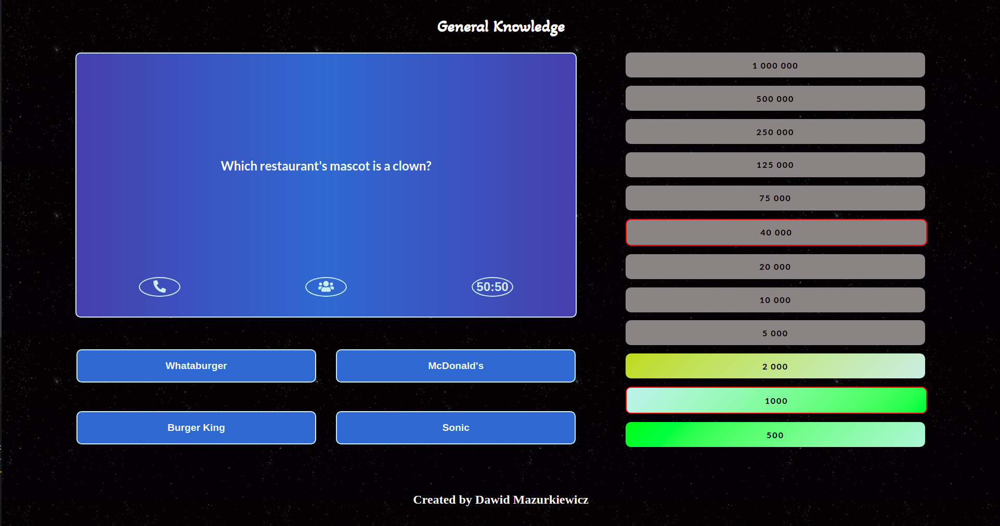

# Document your work
A webapp based on popular television game show _["Who Wants to Be a Millionaire?"](https://en.wikipedia.org/wiki/Who_Wants_to_Be_a_Millionaire%3F)_ using _[Open Trivia API](https://opentdb.com/api_config.php)_. The game involves answering questions, for each good question the prize will increase up to 12 good answers which is main prize

## Table of contents
* [Technologies](#technologies)
* [Setup](#setup)
* [Site](#site)

## Inspiration
The main goal of creating this application was to test the acquired knowledge with Node.js and Express and use SCSS for the first time.

## Technologies
* HTML 5
* CSS 3 (SCSS)
* JavaScript ECS6
* Node.js
* Express

## Setup
* Clone this repo to your desktop
* Run `npm install` to install all dependencies
* Run `node app.js` to start the application

## Site

  

